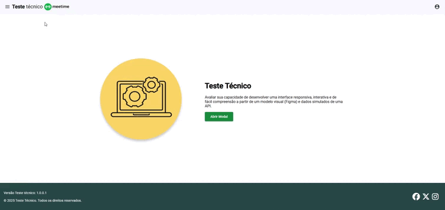

# Projeto: Projeção de Eventos

Este projeto tem como objetivo simular a projeção de eventos futuros com base em ciclos configurados, distribuindo entidades entre eles e exibindo as projeções visualmente.

## Funcionalidades Implementadas

- Consumo de dados simulados a partir de um mock JSON (mock-data.json).
- Exibição de ciclos e sua estrutura de eventos ao longo de 5 dias úteis.
- Campo para informar quantidade de entidades a iniciar.
- Seleção opcional de ciclos com controle via AG Grid.
- Atualização do gráfico com projeção de eventos conforme as entidades são iniciadas.
- Cálculo automático de eventos do dia atual com destaque no gráfico.
- Regras de negócio aplicadas conforme descritas no enunciado.
- Ciclos de maior prioridade já vêm selecionados ao iniciar.
- Modal customizado com scroll invisível e responsividade total.

## Arquitetura do Projeto

Este projeto foi desenvolvido seguindo os princípios de:

- Clean Architecture
- SOLID
- KISS

### Estrutura de pastas

```
src/
├── app/
│   ├── core/                # Regras de domínio e contratos
│   │   ├── models/          # Modelos de domínio: Cycle, EventProjection
│   │   ├── services/        # Abstrações e regras de negócio
│   │   └── utils/           # Funções utilitárias puras (ex: distribuição, cálculo)
│   ├── data/                # Camada de infraestrutura (ex: simulação de API)
│   ├── pages/               # Componentes Angular (telas e visualização)
│   └── shared/              # Componentes reutilizáveis e módulo Material
```

## Como Executar Localmente

1. Clonar o repositório:
   git clone git@github.com:IvaldoSouza/event-projection.git
   cd projecao-eventos

2. Instalar dependências:
   npm install

3. Executar o projeto:
   ng serve

4. Acessar no navegador:
   http://localhost:4200

## Tecnologias Utilizadas

- Angular 19 (standalone)
- TypeScript
- SCSS
- AG Grid
- ApexCharts
- Angular Material

## Regras de Negócio

- O gráfico deve sempre exibir projeções a partir da baseProjection, somando as contribuições das entidades iniciadas.
- Se nenhum ciclo for selecionado manualmente, as entidades são distribuídas automaticamente entre os de maior prioridade.
- A label "Hoje" é posicionada dinamicamente com base no dia atual da semana.
- Sábados e domingos são ignorados.
- O gráfico deve refletir corretamente os dados conforme as entidades são distribuídas nos ciclos.
- O total de eventos para hoje deve ser destacado tanto no card superior quanto na coluna do gráfico.

## Responsividade

- Modal e componentes adaptados para diversos tamanhos de tela.
- Scroll invisível habilitado apenas quando necessário.
- Layout otimizado com media queries para tablets e smartphones.

## Observações

- Este projeto simula o consumo de API com base em dados mockados conforme o link enviado no PDF.
- A lógica foi estruturada para facilitar substituição futura da camada de dados por uma API real.

## Documentação Técnica
[Documentação Técnica](docs/DOCUMENTACAO_TECNICA.md)


## GIF da tela


